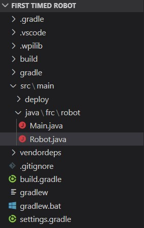

# Before you start your first project

## Getting to know Visual Studio Code

VS Code has a very cool feature called the command palette.

`CTRL + P` opens the command palette.

From here, you can either search for files in your directory (similar to ctrl + k for Discord) and enter commands. To run a command, you need to enter `>`, and then whatever comes after that is the search query for a command. To get people familiar with it, I like to make them use it to change the theme of VS Code. In the text box, enter ">Theme" and select the option "Preferences: Color Theme". You can change which command you have selected by using the `up` and `down` arrow keys, and then pressing `enter` will run the highlighted command. It will bring you to a menu with color themes you can choose from. Repeat this process until you find a theme you like.

Now that you have a theme you like, open the command palette and run the command `WPILib: Create a new project`.

For this guide, you should select something like these values:

!["Template, Java, Timed Robot, [Folder path], checked, [Appropriate name], 3624, unchecked"](Images/new-project-filled-prompt.jpg)

I know you're curious about what the robot base is - everyone asks me what it is the first time they make a project. There are a few different ways to design your robot. The main two are "Command" robots and "Timed" robots. The code for a Timed robot is all in one class while Command robots uses object oriented programming (more CSA stuff). Since Timed robots are much simpler, I always start with that. When working on the software team to program the [INSERT CURRENT YEAR HERE] robot, you will be making a Command robot, but that time will come later.

## Things to be wary of

When you have a robot project open, make sure you have the actual folder open. Let's say I wanted to open my First Timed Robot project

I have my First Timed Robot folder open in the file explorer, but it's not the root folder VS Code has open. I have the "basics" folder open. Yes, "basics" is the root of this Git repository, but it is not the root of a project.

> Fun fact: Some commands that you run in the command palette will run a file. `WPILib: Build Robot Code`, which compiles the code, will try to run "./gradlew" in the terminal. It looks for the file gradlew in the topmost folder you have open. In my example, if you had "basics" open, there is no "gradlew" in the "basics" folder, so it won't work.